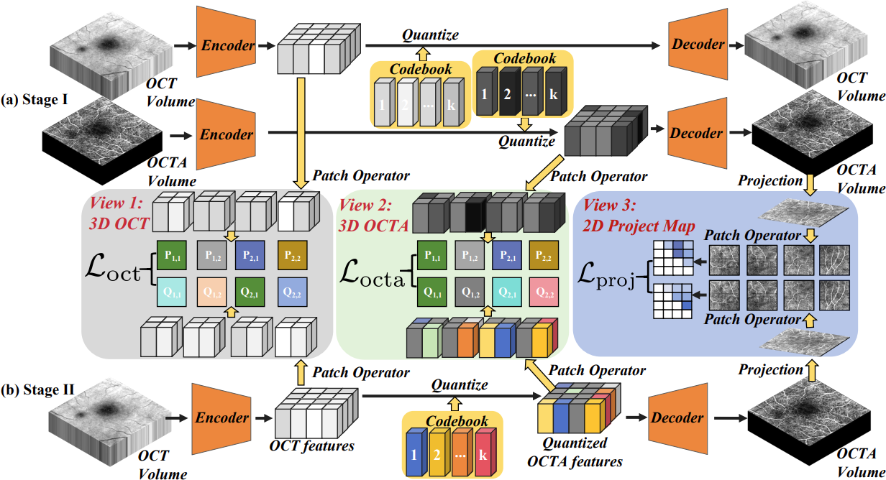

This repository contains the PyTorch implementation of the following paper:

**MuTri: Multi-view Tri-alignment for OCT to OCTA 3D Image Translation**

## Introduction

This work focuses on the OCT to OCTA 3D image translation in discrete and finite space. In the first stage, we pre-train two vector-quantized variational auto-encoder (VQVAE) by reconstructing 3D OCT and 3D OCTA data, providing semantic prior for subsequent multi-view guidances. In the second stage, our multi-view tri-alignment facilitates another VQVAE model to learn the mapping from the OCT domain to the OCTA domain in discrete and finite space. Specifically, a contrastive-inspired semantic alignment is proposed to maximize the mutual information with the pre-trained models from OCT and OCTA views, to facilitate codebook learning. Meanwhile, a vessel structure alignment is proposed to minimize the structure discrepancy with the pre-trained models from the OCTA project map view, benefiting from learning the detailed vessel structure information.



## Installation

- Create conda environment and activate it:
```
conda create -n octa python=3.6
conda activate octa
```
- Clone this repo:
```
git clone https://github.com/cheny124800/MuTri.git
cd MuTri
```

- Install requirements:
```
pip install -r requirements.txt
```

## Usage
### Data preparation
We use OCTA-3M, OCTA-6M, and OCTA2024 datasets in our paper. 

The OCTA-3M amd OCTA-6M datasets are from [OCTA-500](https://ieee-dataport.org/open-access/octa-500)

Please contact us for the access of OCTA2024 dataset with research purpose only

### Train 
- To view training results and loss plots, please run:
```
python -m visdom.server -p 6031
```
and click the URL http://localhost:6031

- Stage I Training, please run:
```
python train_Stage_I.py --dataroot ./octa-500/OCT2OCTA3M_3D --name MuTri_3M_Stage_I --model MuTri --netG unet_256 --direction AtoB --lambda_A 10 --lambda_C 5 --dataset_mode alignedoct2octa3d --norm batch --pool_size 0 --load_size 304 --input_nc 1 --output_nc 1 --display_port 6031 --gpu_ids 0 --no_flip
```

- Stage II Training, please run:
```
python train_Stage_II.py --dataroot ./octa-500/OCT2OCTA3M_3D --name MuTri_3M_Stage_II --model MuTri --netG unet_256 --direction AtoB --lambda_A 10 --lambda_C 5 --dataset_mode alignedoct2octa3d --norm batch --pool_size 0 --load_size 304 --input_nc 1 --output_nc 1 --display_port 6031 --gpu_ids 0 --no_flip
```

### Test
- To test the model, please run:
```
python test.py --dataroot ./octa-500/OCT2OCTA3M_3D --name MuTri_3M_Stage_test --test_name MuTri_3M_Stage_test --model MuTri --netG unet_256 --direction AtoB --lambda_A 10 --lambda_C 5 --dataset_mode alignedoct2octa3d --norm batch --input_nc 1 --output_nc 1 --gpu_ids 0 --num_test 15200 --which_epoch 164 --load_iter 164
```


## :rocket::rocket:  Implementation reference and Express our gratitude
  - https://github.com/ustlsh/TransPro


## :smile::smile: Feel free to contact us 
  - 1248013830@qq.com 

## Citation
If you find our paper is helpful in your research or applications, please consider citing:
```
@inproceedings{chen2025mutri,
      title={MuTri: Multi-view Tri-alignment for OCT to OCTA 3D Image Translation},
      author={Zhuangzhuang Chen, Hualiang Wang, Chubin Ou, Xiaomeng Li},
      year={2025},
      booktitle={IEEE/CVF Conference on Computer Vision and Pattern Recognition (CVPR)},
    }
```